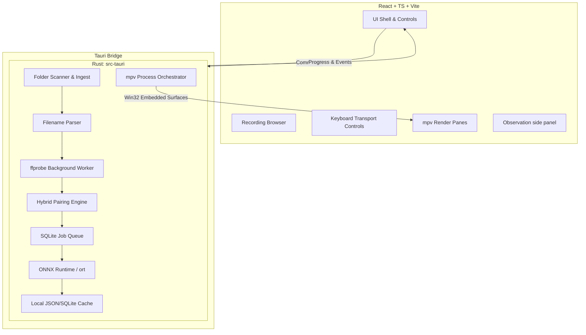

# rawrii - Comprehensive Product Requirements Document (PRD)

## Mission & Goals
Build a Windows-first desktop application for extremely fast browsing and reviewing of paired front/rear dashcam footage. Front and rear files must be treated as a single logical recording in the UI. 

### Primary Goals
1. Auto-detect and pair front/rear clips from a designated folder. [IMPLEMENTED]
2. Browse paired clips as a single logical unit. [IMPLEMENTED]
3. Maintain smooth keyboard-first navigation and seeking. [IMPLEMENTED]
4. Provide synchronized dual-pane playback via embedded `mpv`. [IMPLEMENTED]
5. Keep the UI highly responsive when dealing with large folders. [IMPLEMENTED - ASYNC QUEUE]
6. **Extract and utilize embedded file metadata** (via ffprobe) to guarantee accurate pairing and playback synchronization. [IMPLEMENTED - ASYNC]
7. **Generate searchable machine-learning observations** (e.g., vehicles, colors, license plates) from footage using local-first processing. [IN PROGRESS - REAL ONNX INTEGRATED]

### Secondary Goals (Phase 2+)
1. Mark in/out ranges and keep segments.
2. Maintain a kept-segments decision list.
3. Export segments via `ffmpeg` in minimal layout modes (side-by-side, front-only, rear-only).
4. Export observation reports (CSV/JSON) alongside video clips.

### Non-goals (v0/v1)
- Full nonlinear editor capabilities (NLE)
- Effects/transitions/color grading/audio workflows
- Cloud/mobile/collaboration features
- Custom media decode engine

---

## Tech Stack & Architecture

### Mandatory Tech Stack
- **Desktop Shell:** Tauri
- **Frontend:** React + TypeScript + Vite
- **Backend/Core:** Rust
- **Playback Engine:** `mpv` (via IPC and Win32 child surfaces)
- **Metadata/Export:** `ffmpeg` / `ffprobe` (Asynchronous worker pool)
- **Local AI Inference:** ONNX Runtime (via `ort` Rust crate)
- **Primary Target OS:** Windows 11 (MSVC builds)
- **Development Environment:** Windows Subsystem for Linux (WSL2). *Note: The application targets Windows first, but development occurs under WSL2. Code must account for Linux compilation requirements (like dummy video surfaces or GTK libraries) during local testing while retaining Win32 specifics for the final deployment.*

### Architecture Diagram

### Core Data Models
1. **VideoAsset:** Represents a single video file. Now includes `MediaMetadata` derived from ffprobe.
2. **MediaMetadata:** Authoritative file data: duration, creation_time, resolution, codec, and stream health.
3. **RecordingPair:** Logical grouping of assets. Pairing confidence is now derived from a hybrid of filename and metadata signals.
4. **ObservationEvent:** A timestamped detection (Vehicle, Plate, Color) with confidence scores and bounding boxes.
5. **PlaybackSnapshot:** Tracks synchronized playheads and offsets across the pair.

---

## Patterns & Guidelines

### Development Conventions
- **Hybrid Pairing:** Use filename sequence as a hint, but use `creation_time` and `duration` from metadata as authoritative for synchronization and pairing validation.
- **Local-First AI:** All ML inference (YOLOv8, OCR) must occur locally on the user's machine to preserve privacy and minimize latency.
- **Staged Ingest:** 
    1. Scan (Instant) -> 
    2. Metadata Extraction (Background/Seconds) -> 
    3. AI Analysis (Background/Minutes).
- **Embedded Playback:** Dual `mpv` instances use JSON IPC for shared logical playhead and periodic drift correction.

### Filename Realities & Pairing (K6-Compatible Profile)
- Baseline naming: `YYYYMMDD_HHMMSS_<sequence>_[F|R].MP4`
- **Heuristic:**
  1. Parse candidates via filename.
  2. Enrich with `ffprobe` metadata.
  3. Map front assets to nearest unassigned rear asset within threshold.
  4. Reconcile filename timestamps with embedded `creation_time`. Flag mismatches.

---

## Guardrails, Rules, and Tests

### Guardrails & Rules
- **No Blocking UI:** Heavy operations (scan, metadata, AI) MUST run asynchronously in Rust worker pools.
- **Privacy:** License plates are PII. Local processing is mandatory. Provide a "Clear Analysis Cache" feature.
- **Uncertainty UX:** Low-confidence ML detections (< 0.60) must be visually distinguished or obfuscated to prevent false reliance.
- **Safety First for Files:** Read-only access for scans and analysis.

### Robust Checks and Tests
1. **Metadata Reconciliation Tests:** Verify that the system correctly handles cases where filename timestamps and embedded metadata disagree. [IMPLEMENTED]
2. **Pairing Regression:** Ensure hybrid pairing maintains or improves the accuracy of the baseline K6-compatible parser. [PASSED]
3. **OCR/Analysis Validation:** Use a small fixture of dashcam frames to ensure detection confidence remains stable across model updates. [PENDING FULL MODEL INTEGRATION]
