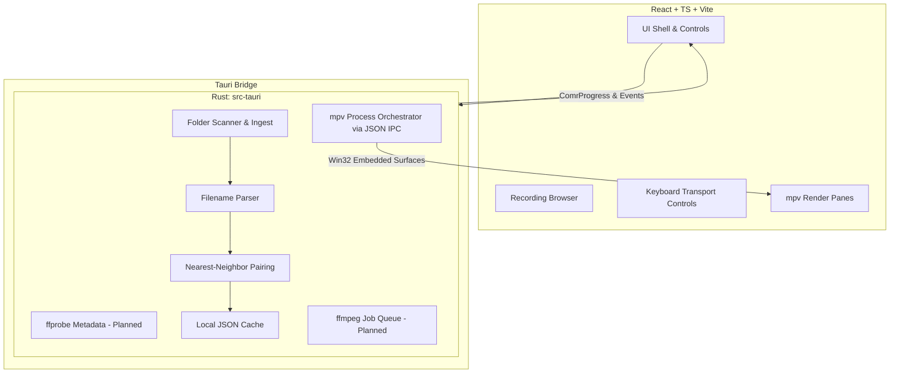

# rawrii - Comprehensive Product Requirements Document (PRD)

## Mission & Goals
Build a Windows-first desktop application for extremely fast browsing and reviewing of paired front/rear dashcam footage. Front and rear files must be treated as a single logical recording in the UI. 

### Primary Goals
1. Auto-detect and pair front/rear clips from a designated folder.
2. Browse paired clips as a single logical unit.
3. Maintain smooth keyboard-first navigation and seeking.
4. Provide synchronized dual-pane playback via embedded `mpv`.
5. Keep the UI highly responsive when dealing with large folders.

### Secondary Goals (Phase 2+)
1. Mark in/out ranges and keep segments.
2. Maintain a kept-segments decision list.
3. Export segments via `ffmpeg` in minimal layout modes (side-by-side, front-only, rear-only).

### Non-goals (v0/v1)
- Full nonlinear editor capabilities (NLE)
- Effects/transitions/color grading/audio workflows
- Cloud/mobile/collaboration features
- Custom media decode engine

---

## Tech Stack & Architecture

### Mandatory Tech Stack
- **Desktop Shell:** Tauri
- **Frontend:** React + TypeScript + Vite
- **Backend/Core:** Rust
- **Playback Engine:** `mpv` (via IPC and Win32 child surfaces)
- **Metadata/Export:** `ffmpeg` / `ffprobe` (planned)
- **Primary Target OS:** Windows 11 (MSVC builds)

### Architecture Diagram

### Core Data Models
1. **VideoAsset:** Represents a single video file, tracking its `side` (Front/Rear), sequence, parsed timestamps, size, duration, health, and warnings.
2. **RecordingPair:** Logical grouping of a front and rear `VideoAsset`, containing an estimated duration, a canonical start time, pairing confidence, pairing reason, and warnings.
3. **PlaybackSnapshot:** Tracks the active playback session, playheads, offsets, load states, and synchronization deltas.
4. **ScanResult & ScanDiagnostics:** Provides metrics and error reporting for a folder scan.

---

## Patterns & Guidelines

### Development Conventions
- **Tauri Dependency Policy:** Use compatible, published versions from the Tauri ecosystem rather than forcing strict numeric sameness. Use `src-tauri/Cargo.lock` for deterministic resolution.
- **Backend/Frontend Isolation:** Keep all playback orchestration and file parsing tightly bounded within Rust modules. The frontend should act as a pure, reactive UI shell.
- **Embedded Playback:** Dual `mpv` instances use JSON IPC for shared logical playhead, synchronized pause/seek controls, and periodic drift correction. Surfaces rely on Win32 child-window integration.
- **Caching:** Scanned folders are cached in the local app-data JSON store to enable fast warm-open.
- **Keyboard-first Navigation:** `Space` for play/pause, arrows/shift-arrows for seek, `J`/`K` or `Up`/`Down` for next/previous pair, `[`/`]` for in/out marks.

### Filename Realities & Pairing (K6-Compatible Profile)
- Baseline naming structure matches K6 cameras: `YYYYMMDD_HHMMSS_<sequence>_[F|R].MP4`
- Front and rear timestamps often drift by ~1 second.
- **Heuristic:**
  1. Parse candidates; reject non-video files or unmatched formats (e.g., photos).
  2. Split lists by side and sort by timestamp.
  3. Map front assets to the nearest unassigned rear asset within a predefined time threshold.
  4. Never double-assign sides. Partial pairs emit clear UI warnings.

---

## Guardrails, Rules, and Tests

### Guardrails & Rules
- **No Blocking UI:** Heavy operations (e.g., large folder scans, upcoming ffprobe routines, ffmpeg exports) must run asynchronously in Rust, emitting progress events.
- **Safety First for Files:** Read-only access for scans. When exporting is implemented, use robust error handling and avoid overwriting source files.
- **Validation Dataset:** The `.test_examples` folder is a first-class local test suite. Any changes to parsing/pairing must be tested against this real-world naming set without regressing pair count expectations.

### Robust Checks and Tests
1. **Filename Parser Checks:**
   - Must successfully parse front (`_F`) and rear (`_R`) MP4 files, regardless of casing.
   - Must reject non-matching profiles, non-video extensions (`.JPG`), or malformed dates/times.
   - Example checks: `parse_k6_filename("20260323_114324_000023_F.MP4")` returns `VideoSide::Front`, sequence `23`, and accurate date-time.
2. **Pairing Checks:**
   - Must correctly handle front/rear pairs with slight timestamp drift (e.g., `20260323_114324` vs `20260323_114325`).
   - Must generate partial pairings and surface exact failure reasons when one side is missing or exceeds the pairing threshold.